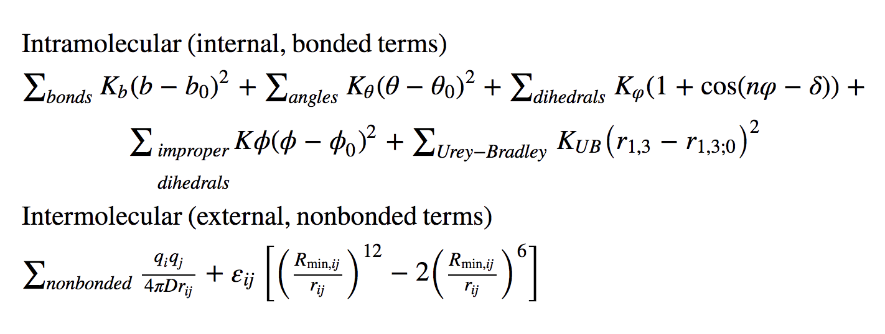

# CGenFF Dissimilarity Score


The algorithm is pretty simple. The philosophy is atom types are perhaps a better way of indicating similarity than using the existing fingerprinting mechanisms. This helps map out accurately different atom types that have some actual physical meaning. The&#x20;



Similarity is weighted in accordance to the CHARMM potential energy function. Each term is an appropriate classifier into a molecule where we have our **bonded** terms: bonds, angles, dihedrals, impropers, urea-bradley and our **non-bonded:** Coloumbic interactions and the Lennard-Jones "6-12" potential that accounts for Pauli Repulsion and London Disperson forces between two atoms.&#x20;

A geographical representation of the classifiers can be found below:


For similarity we only take into account the bonded terms except Urea-Bradley, each weight is assigned from reverse order with higher weights being associated with bonds and decreases incrementally as we approach classifiers that include more atom terms.&#x20;

| Classifier         | Atom Terms | Weight |
| ------------------ | ---------- | ------ |
| Bonds              | 2          | 4      |
| Angles             | 3          | 3      |
| Dihedrals          | 4          | 2      |
| Improper Dihedrals | 4          | 2      |

**Import**

```
from global_chem_extensions import GlobalChemExtensions
ff = GlobalChemExtensions().forcefields()
```

**Compare Two Molecules**

The higher the score the more dissimilar it is between each other.&#x20;



```
dissimilar_score = ff.compute_cgenff_dissimilar_score(
   'global-chem/example_data/forcefield_parameterization/perfluorobutanoic_acid.str',
   'global-chem/example_data/forcefield_parameterization/perfluorohexanoic_acid.str',
)

print ("CGenFF Dissimilar Score: %s" % dissimilar_score)
```



```
CGenFF Dissimilar Score: 26
```


